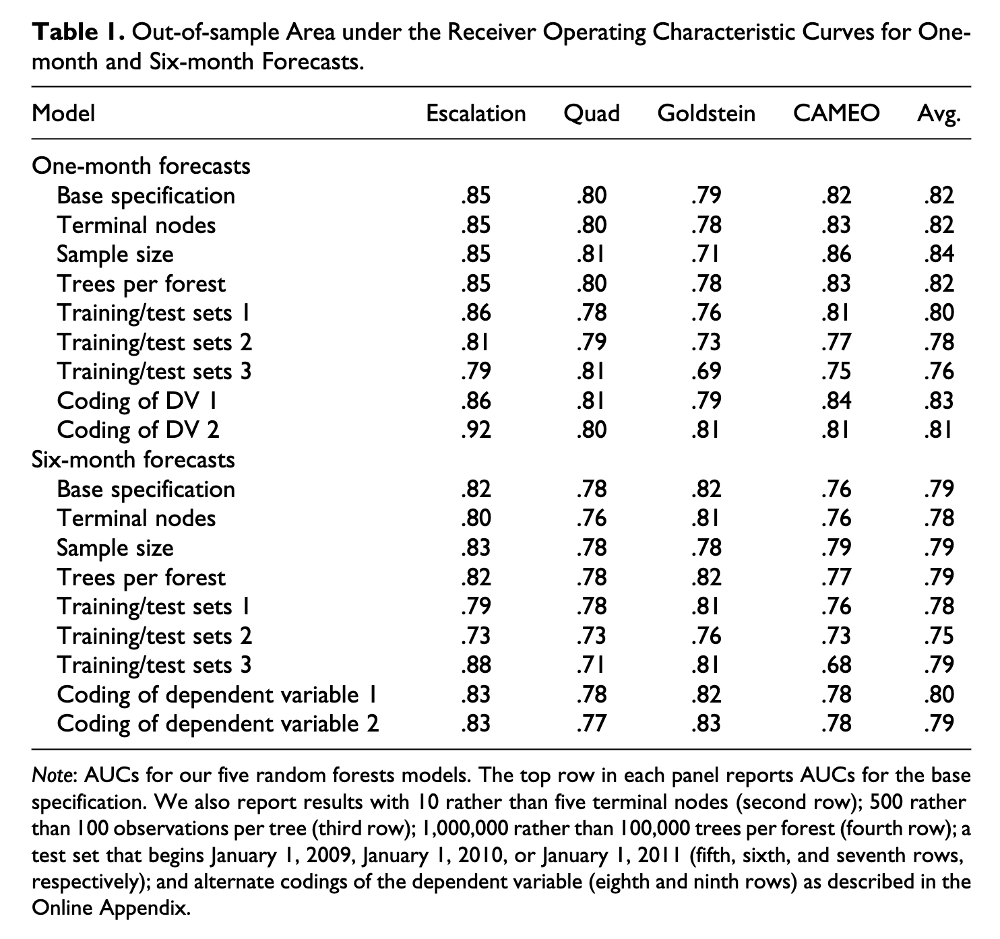

```{r setup, include=FALSE}
knitr::opts_chunk$set(echo = FALSE)

library(readr)
library(dplyr)
library(kableExtra)
```


We highlight some issues with the analysis in the recent Blair and Sambanis paper that undermine their main empirical finding, that a theoretically-informed escalation model can forecast civil war onsets better than more inductive alternatives. Their paper has two key results: 

1. A theoretically-informed model outperforms alternative specifications in predicting civil war onset. 
2. Structural variables do not add, and sometimes detract, from the forecast accuracy of the escalation model. 

They also evaluate forecasts for the first half of 2016 and conclude good accuracy in forecasting civil war. 

We find three issues in their empirical analyses:

- The first key finding depends entirely on using smoothed ROC curves when calculating the AUC-ROC values in Table 1. When using the original ROC curves, the findings reverse. Alternative specifications consistently beat the escalation model.
- Regarding the forecast assessment in Table 4, the forecatss for 2016-H1 are erraneously assessed using civil war incidence, not onset, even though the models from which they are gneerated are clearly fitted to onset. This vastly overstates the precision of the forecasts. 
- The way the random forest models are fitted by B&S is very unorthodox.^[This is in fact what first led us to examine the analysis in more detail.] We evaluate two questions: (1) does the key model's superior test forecast performance generalize or is it a result of inadvertant fitting of the model hyperparameters to test forecast performance, and (2) does the inferior performance of the alternative models, and especially the CAMEO model with 1,159 covariates, reflect a lack of proper hyperparameter tuning for these models? (work still in progress)

# Review of the Blair and Sambanis paper

@blair2020forecasting (B&S) argue that theory contributes to forecasting accuracy even when using non-parametric machine learning models and alternative specifications that are not informed by theory. They arrive at this conclusion by examining the problem of predicting civil war onset, and find that a parsimonious model using a small number of covariates derived from escalation theories of conflict can forecast civil war onset better than alternative specifications based on generic covariates not specifically informed by theory and a kitchen sink model with more than 1,100 covariates. 

Their data consist of country-month observations covering 2001 to 2015. The main outcome is civil war onset, measured using Sambanis' data. The independent variables for the first set of analysis reported in Table 1 in the paper are all derived from the ICEWS event data, using domestic events between actors within a country. They key results are based on a comparison of the forecast accuracy of a random forest (RF) model with 4 covariate specifications as well as an ensemble model:

- Escalation: a set of 10 theoretically-informed indicators.
- Quad: ICEWS quad counts, i.e. material conflict, material cooperation, verbal conflict, verbal cooperation.
- Goldstein: -10 (conflictual) to 10 (cooperative) scores derived from the ICEWS data for interactions between the government one one side and opposition or rebel actors on the other. These are directed, thus making for 4 total covariates.
- CAMEO: counts for all CAMEO event codes, thus a total of 1,159 covariates. 
- Average: unweighted average of the predictions from the 4 models above.

To assess forecast accuracy, B&S:

1. Split the training data into training (2001 - 2007) and test (2008 - 2015) sets.
2. Estimate 5 random forest models with the specifications from above. 
3. Create out-of-sample (OOS) predictions from each model for the test set. 
4. Calculate AUC-ROC measures for each set of OOS predictions.

This is done for both 1-month ahead and 6-month ahead forecasts. B&S also conduct a series of robustness tests that (1) vary hyperparameters of the RF model, (2) change the split year for the trainin/test data split, and (3) alternative codings of the dependent variable. 

The results for this analysis are summarized in Table 1 in the B&S paper, which we reproduce here:



The escalation model generally outperforms the alternative models/specifications, and on that basis B&S conclude that theory does indeed provide better forecast accuracy when compared to models not informed by theory.

Before listing the primary issues we identified, we should note that we are partial to their approach. Theory is important. It is helpful for forecasting problems, especially with regards to identifying which variables to include in a model. This is particularly true when the goal is to assess how ... (RM: I want to add something here about identifying potential policy interventions that can help advert onset...)

# Issues

## Smoothed ROC curves

```{r, message=FALSE}
auc <- read_csv("data/table1-redone.csv") %>%
  mutate(specification = factor(specification, levels = c("escalation", "quad", "goldstein", "CAMEO", "avg"))) %>%
  arrange(model, horizon, specification)

auc %>%
  knitr::kable(digits = 2, booktabs = TRUE, caption = "Comparison of smoothed and original AUC-ROC values")
```


Using AUC-ROC values from un-smoothed, original ROC curves reverses the original conclusions from B&S Table 1. In both the 1 month-ahead and 6-month ahead forecasts, the escalation model is outperformed by alternative models. 


<!-- \input{data/replicated-table-1.tex} -->

## Assessment of the 2016 forecasts

The predictions for the first half of 2016 are assessed in Table 4:


The table presents 15 or 16 positive cases for 2016-H1, depending on a minor coding decision. These numgers correspond to a positive rate of around 9.5% for the first half of 2016. 

By comparison, the 6-month version of the full data from 2001 to 2015 contains only 20 positive cases, with a positive rate of around 0.5%. 

The relevant variables in the data are "incidence_civil_ns" and "incidence_civli_ns_plus1", which appears to be a 1-period lead version of the DV that is used in the actual prediction models. The incidence DV contains both 0/1 and missing values. By examining the pattern of missing values, it seems clear that this was originally an incidence variable indicating whether a country was at civil war in a given year or not, and which was converted to an onset version so that onsets retain the value of 1 but continuing civil war years are coded as missing. 

The main data set covering 2001 - 2015 contains 20 civil war onsets. But there are 15 "Persistence" cases (top of table 4) and 16 "Change" cases (bottom of table 4)

By examining the code used to generated Table 4, we were able to confirm that the onset forecasts are assessed using incidence, not onset. In the file `6mo_make_confusion_matrix.do` on line 52, missing values in "incidence_civil_ns" are recoded to 1, thus reverting the onset coding of this variable back to incidence. 

The actual data contains 0 new civil war onsets in 2016-H1. Using those data, the 2016-H1 forecasts would have retained a recall value of 1, but precision would have decreased from 13/30 = 0.76 to 1/30 = 0.03.  

The second part of the Table 4 script manually codes onset in two countries, Turkey and Burundi. With this coding, the correct recall (bottom of Table 4) is 1 (not 14/16 = 0.88) and the precision changes from 14/30 = 0.47 to 2/30 = 0.07. 

Another, minor issue or rather coding error, is related to using a lead version of the DV. With the lead version of the DV, "incidence_civil_ns_plus1", which is what the models are predicting, the predicted value for 2016-H1 actually indicates the risk of civil war onset in 2016-H2. In the Table 4 script referenced above, the 2016-H1 predictions (for 2016-H2) are assessed using the raw DV, "incidence_civil_ns", not the lead version. Essentially, the forecasts for 2016-H2 are assessed using observed outcomes for 2016-H1. In this case it probably doesn't make a difference since both the raw DV and lead version for 2016-H1 do not have any positive values. 

## Random forest model tuning

3. Unorthodox RF hyperparameter choices that may be driving the OOS test prediction results. There are two issues here. One is that the RF models are so unorthodox. I'm not sure that this in itself is a problem. But the second potential problem is that the hyperparameter values may not have been tuned in a way that works the best for the non-escalation model, and especially the CAMEO model with 1,100+ features. 

- Improperly tuning of models
  - RM: In a twitter DM, I asked Blair to clarify -- "[I] was wondering how you all came to your tuning procedure for the RF model hyper-parameters?" He responded "mostly trial and error, honestly. ... Trial and error was on early data. Forecasts were for much later data"
- Using a regression framework in a classification problem
- Rounding of AUC/ROC scores
    + AB: smoothing or rounding? I think rounding is ok. 
- Treating the output of a RF regression model as Pr() -- (RM: I guess this is akin to a Linear Probability Model, but I'm not sure if this is possible in a RF framework
    + It's hacky but it works. The resulting forecasts are within the 0-1 interval.

The table below shows the randomForest package default hyperparameter values for a binary classification problem like the one at hand and compares them to the B&S base settings. Some hyperparameters have heuristics that determine the default value based on characteristics of the input data; we note these in the second column and what the realized default setting would be for the basic Escalation model (first row in Table 1 in the paper) in the 3rd column. The last column has the settings B&S use. 

|Hyperparameter|Default heuristic|Default values (Escalation)|B&S value|
|--------------|-----------------|--------------------------|---------|
|type          |                 | classification           | regression|
|ntree         |                 | 500                      | 100,000 |
|mtry          |`floor(sqrt(ncol(x)))`|3|3|
|replace       |                 | true | false |
|sampsize | `nrow(x)` if replace, else `ceiling(.632*nrow(x))` | 11,869 | 100 |
|nodesize | 1 for classification | 1 | 1 |
|maxnodes | | null | 5 |

It is worth noting that commonly the ntree, mtry, and nodesize parameters are the main parameters tuned; of these three in the B&S specification only 1, the ntree parameter, deviates from the default settings. 

In any case, there is a stark contrast in the default RF settings and the way B&S use the RF models. The default approach is to train a relatively small number (ntree; 500) of classification trees, but where each tree is fairly big in that it is trained on data that has the same number of rows as the training data, albeit sampled with replacement (replace is true; sampsize is 11,869), and allowed to grow fairly deep (this is governed by nodesize (1), which is the minimum size a terminal node must have). In contrast, B&S grow very extensive forests with a large number of trees (100,000 compared to 500), but each tree is very small and shallow; only a 100 rows are sampled from the training data for each tree, and the trees are constrained to at most 5 terminal nodes (maxnodes). 

This approach only works due to the other unorthodox choice, which is to use regression, not classificaton, trees. Trying to use classification trees with the other parameter settings in fact does not work at all because it is almost guaranteed that a sample of 100 from the 11,869 training data rows with 9 positive cases will only include 0 (negative) outcomes in the sample. As it is, using regression with a 0 or 1 outcome produces warnings when estimating the models: 

```
Warning message:
In randomForest.default(y = as.integer(train_df$incidence_civil_ns_plus1 ==  :
  The response has five or fewer unique values.  Are you sure you want to do regression?
```

While unorthodox, the approach does work. It produces predictions that are within the 0 to 1 interval. The concern is that the settings work well only for the escalation model, and only for the particular test set at hand. Specifically, we wonder (1) if the hyperparameter settings only work well for the particular test set chosen, and (2) if the CAMEO model with 1,100+ features, compared to 10 or less for the other specifications, would perform better with a more explicit tuning procedure.

## Are the RF hyperparameters overfit to the test set?

Does the base specification's good performance in the test set generalize? 

One initial piece of evidence is already available from Table 1. In addition to the test set starting 2008, B&S also evaluate test sets starting in 2009, 2010, and 2011 (sets 1, 2, and 3 in Table 1). For the 1 month models, when we compare the base specification performance of each model to the performance in the alternate test sets, the AUC-ROC increases in 2 (of 15) cases, is the same in 0 cases, and decreases in 13 cases. For the 6 month models, it increases in 1 case, is the same in 3 cases, and decreases in 11 cases. Altering the test set thus generally shows reduced performance. 
The table below shows cross-validated training and OOS test AUC-ROC for the original 1 month escalation model, a RF model with default hyperparameter settings, and a tuned RF model with 10,000 trees and otherwise the default settings. The first set of results are out of sampel results from repeated cross-validations performed on the training data. We show the average AUC-ROC, it's lower and upper 95\% CI, obtained via bootstrapping, and the standard deviation of the distribution of resampled AUC-ROC values.

Because there are only 9 positive cases in the whole training data, and thus to ensure that any given split will include at least 1 positive case in each data partition, we use 2-fold CV, i.e. splitting the original training data into equally-sized new training and validation sets. This is repeated 21 times for a total of 42 OOS performance samples for each model. The last column shows the OOS performance on the original test set. The first value in this column corresponds to the base escalation model results reported Table 1 in the B&S paper when *not* using smoothed ROC curves. 

```{r}
tbl <- structure(list(Model = c("Escalation, 1mo", "Modified Escalation, 1mo", 
"Tuned Escalation, 1mo"), Avg_CV_ROC_AUC = c(0.677707841149067, 
0.619719616721681, 0.671630392456263), ci_lower = c(0.634101138978023, 
0.5835673668958, 0.634713167892701), ci_upper = c(0.722598486545989, 
0.65584632967561, 0.706310478133188), SD_CV_ROC_AUC = c(0.147542574525528, 
0.122337186539073, 0.117973980721395), Test_ROC_AUC = c(0.783352194140576, 
0.586147564308735, 0.582927991423296)), row.names = c(NA, -3L
), class = c("tbl_df", "tbl", "data.frame"))

knitr::kable(tbl, digits = 2)
```

The results show that:

- Both of the alternative RF models are able to achieve roughly similar OOS performance in the training data split. *T*-tests comparing model 1 to the other models fail to reject the null hypothesis at a 95\% confidence level. (A *t*-test comparing model 1 and 2 average AUC-ROC just barely fails to reject the null hypothesis (*p* slightly above 0.05).)
- Only the base escalation model is able to achive good test performance; the other two models, despite achieving similar training data performance, have significantly lower test performance. 

This suggests that the base RF specifications are (over-)fit to the test data. 

4. Design choices

Rick, I think the points below are more subjective choices. The first two points above are IMO potentially objectively incorrect technical errors that could undermine the original B&S findings. The 3rd point about the RF models is somewhere between objective error and subjective choice. I'm not sure. But the points below I would say are subjective choices that could alter their findings and that I think are justifiable criticisms, but I think it'll be easier for someone to push back on this if they wanted to. 

- Their train/test approach 
  - 5-year forecasts for sep plots and AUC scores)
- Smoothing of AUC/ROC scores
- Lack of yearly test forecasts in favor of a single 5-year test forecast
- The lack of procedures to account for rare events in an RF model

To-do

1. Full replication
    - Can we get their results
    - RM: maybe I can go through their code and bring it "up-to-date" i.e. make it tidy... 
        + AB: that sounds like a lot of work
    - Figure out how they built table 4 (It looks like this is done in STATA)
    - Check to see if it matter that they are using regression for a classification problem
        + AB: i tried switching the models as they have them just from regression to classification and it breaks because the data samples end up being all 0's. 
2. Address tuning 
    - Does properly tuning the CAMEO model improve its performance?
3. Address AUC/ROC smoothing... 
    - How drastic is the change; does it change their conclusions? 
4. Run a yearly test forecast -- as is the current standard in TSCS forecasts (Is it the current standard?) 
5. 

# References
