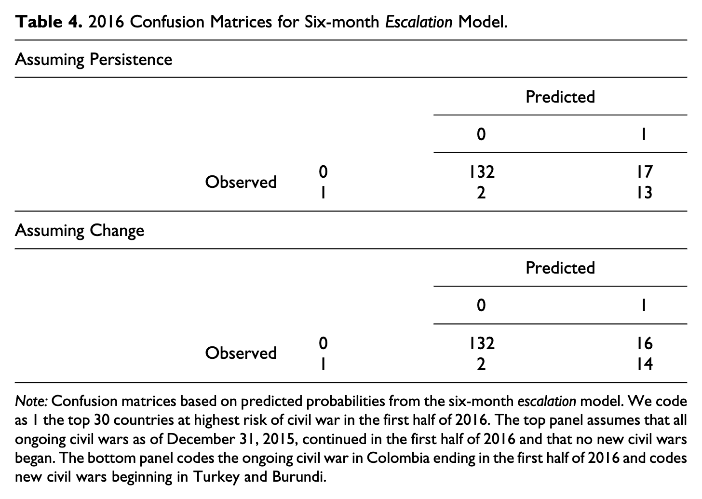

```{r setup, include=FALSE}
knitr::opts_chunk$set(echo = FALSE, message=FALSE)

library(readr)
library(dplyr)
library(tidyr)
library(kableExtra)
```


We highlight some issues with the analysis in the recent @blair2020forecasting paper that undermine their main empirical finding -- that a theoretically-informed escalation model can forecast civil war onsets better than more inductive alternatives. Their paper has two key results: 

1. A theoretically-informed model outperforms alternative specifications in predicting civil war onset. 
2. Structural variables do not add, and sometimes detract, from the forecast accuracy of the escalation model they advance. 

These results are highlighted in Table 1 and Table 2 [@blair2020forecasting, pg. 13 and 19 respectively]. They also evaluate forecasts for the first half of 2016 and conclude good accuracy in forecasting civil war (Table 4 on pg.23). 

We find that:

- the first key finding depends on using AUC values calculated for *smoothed*, not the original, ROC curves
- the 2016 forecasts are incorrectly assessed using the occurrence (incidence), not onset, of civil war

# Review of the Blair and Sambanis paper

@blair2020forecasting argue that theory contributes to forecasting accuracy even when using non-parametric machine learning models (in this case, the random forest model) and alternative specifications that are not informed by theory. They arrive at this conclusion by examining the problem of predicting civil war onset, and find that a parsimonious model using a small number of covariates derived from escalation theories of conflict can forecast civil war onset better than alternative specifications based on generic covariates not specifically informed by theory and a kitchen sink model with more than 1,000 covariates. 

Their data consist of country-month observations covering 2001 to 2015. The main outcome is civil war onset, measured using Sambanis' civil war dataset. The independent variables for the first set of analysis reported in Table 1 in the paper are all derived from the ICEWS event data, using domestic events between actors within a country. The key results are based on a comparison of the forecast accuracy of a random forest (RF) model with 4 covariate specifications as well as an ensemble model. These models are:

- Escalation: a set of 10 theoretically-informed indicators.
- Quad: ICEWS quad counts, i.e. material conflict, material cooperation, verbal conflict, verbal cooperation.
- Goldstein: -10 (conflictual) to 10 (cooperative) scores derived from the ICEWS data for interactions between the government one one side and opposition or rebel actors on the other. These are directed, thus making for 4 total covariates.
- CAMEO: counts for all CAMEO event codes, thus a total of 1,159 covariates. 
- Average: unweighted average of the predictions from the 4 models above.

To assess forecast accuracy, Blair and Sambanis conduct the following procedures:

1. Split the training data into training (2001 - 2007) and test (2008 - 2015) sets.
2. Estimate 4 random forest models with the specifications from above as well as a unweighted average of the models. 
3. Create out-of-sample (OOS) predictions from each model using the test set. 
4. Calculate AUC-ROC measures for each set of OOS predictions.

This is done for both 1-month ahead and 6-month ahead forecasts. Blair and Sambanis also conduct a series of robustness tests that (1) vary hyperparameters of the RF model, (2) change the split year for the training/test data split, and (3) alternative codings of the dependent variable. 

# Smoothed ROC curves

## Comparison of the escalation specification to alternatives (Table 1)

The results for the core analysis are summarized in Table 1 in @blair2020forecasting, which we copied in Figure 1 below.


The first row, each, for the one-month and 6-month forecasts are the core base specification. The additional rows reflect various robustness tests. 

The escalation model generally out-performs the alternative models/specifications, and on that basis Blair and Sambanis conclude that theory does indeed provide better forecast accuracy when compared to models not informed by theory.

A small detail, which is mentioned in the text and visually obvious in the ROC curves they show in B&S Figure 1, is that these AUC-ROC values are computed using smoothed ROC curves. We used their replication code to recreate the ROC curves in their figure, which are shown in the left two panels in the figure below. The curves indeed appear to be very smooth. But in the underlying test data for which these curves are, there are only 11 positive events, out of 2,366 rows for the 6-month data and 13,748 rows for the 1-month data. The ROC curves in the two panels on the right are the original, non-smoothed versions, which correctly reflect the small number of positive events.^[The diagonal lines in the ROC curves are there because there are groups of cases which have identical predictions, causing jumps in both the true and false positive rates at the same time.]


\clearpage

Using these smoothed and non-smoothed curves, we then replicate B&S Table 1 (page 13), but now the table reports the AUC-ROC scores for each model specification with and without the use of a smoother. We focus on the core "Base specification" models only, not the additional robustness checks shown in the other rows in the table. The results of this are shown in our Table 1 above.


First, note that we were unable to exactly reproduce the AUC-ROC values for all models. For example, in B&S the 1-month CAMEO has a AUC-ROC of 0.82, while our reproduction has a AUC-ROC value (using the smoothed version) of 0.84. This is most likely a function of the version of `R` Blair and Sambanis used to conduct their analysis. The current replication project was done using `R version 4.0.0`, which updated their random number seeding procedure, so small differences should be expected. Despite these small differences, the way we would interpret the smoothed-version results does not change. In the 1-month version of the Base Specification, the Escalation model outperforms all alternatives; in the 6-month version it outperforms all but one alternative and has equal performance with the Goldstein model. 

When we calculate the AUC-ROC values using the original, non-smoothed curves, the findings change substantially. Rows 2 and 4 in Table 1 show the non-smoothed AUC-ROC values for the 1-month and 6-month versions, respectively. In the 1-month version, the escalation model is outperformed by 2 alternatives and even with the other 2. In the 6-month version, all 4 alternatives outperform the escalation model. When using the original, non-smoothed ROC curves, the escalation model has the worst overall performance out of the 5 models considered. The first key finding in the paper, that the escalation model is superior to the alternative models, thus depends on using smoothed ROC curves when calculating the AUC-ROC statistic. 


\newpage

## Comparison of the escalation model to structural extensions (Table 2)

After establishing that the escalation model they advance out-performs all other covariate specifications, Blair and Sambanis move to show how the inclusion of structural risk variables -- the set of structural variables identified by the Political Instability Task Force (PITF) that can contribute to an increased risk of civil conflict. A copy of B&S Table 2 is included in Figure 3. 


On page 20:

> Overall, our results suggest that while measures of structural risk may improve predictive performance, the value they add is marginal and inconsistent. Of the approaches we test, the split-population analog is most promising, with AUCs of .84 and .83 over one-month and six-month windows, respectively.

Table 2 is our recreation of B&S Table 2, copied in Figure 3, with AUC values for both smoothed and the original ROC curves. 


Note that we were again unable to reproduce some of the AUC values in Table 2. Values that are notably different are 1-month "Weighted by PITF" and "PITF Split Population", and 6-month "PITF Split Population". For all three of these, the AUC-ROC values we obtained are much better than those in the original Table 2. The values for 6-month "PITF Only" and "With PITF Predictors" are slightly off but could be rounding errors.

Despite these reproduction differences, the original interpretation mostly still stands. The various efforts to incorporate structural variables into the forecasts largely do not work or do not add much predictive value. In the 6-month forecasts, the value added by simply adding the annual structural predictors to the existing random forest model is more pronounced than before, while the PITF split population approach fares much worse. 

Although the substantive interpretation does not change much as a result of using ROC curve smoothing, the absolute AUC-ROC values between the smoothed and original versions do differe by quite a bit in several instances. The AUC-ROC values differ by 0.05 or more in 5 of the 10 cells in the original Table 2, and the direction of change is in all cases such that using smoothed ROC curves present more optimistic performance values. 

# Assessment of the 2016 forecasts

The predictions for the first half of 2016 are assessed in B&S Table 4:



The table presents 15 or 16 positive cases for 2016-H1, depending on a minor coding decision. This is the difference between the top and bottom confusion matrices. From the confusion matrices we can infer that the test data had a reported positive rate of around 9.5% for the first half of 2016. In contrast, the corresponding 6-month version of the data from 2001 to 2015, with 30 half-years, has in total 20 civil war onset events, for a positive rate of around 0.5%. Since the positive event rate in the confusion matrices far exceeds the rate of observed civil war onsets in both the training and test data, we suspected that the forecasts were erranously assessed using civil war incidence, not onset. 

The relevant variables in the data are "incidence_civil_ns" and "incidence_civil_ns_plus1", which appears to be a 1-period lead version of the DV that is used in the actual prediction models. The incidence DV contains both 0/1 and missing values. By examining the pattern of missing values, it seems clear that this was originally an incidence variable indicating whether a country was at civil war in a given year or not, and which was converted to an onset version so that onsets retain the value of 1 but continuing civil war years are coded as missing. 

By examining the code used to generated Table 4, we were able to confirm that the onset forecasts are assessed using incidence, not onset. In the file `6mo_make_confusion_matrix.do` on line 52, missing values in "incidence_civil_ns" are recoded to 1, thus reverting the onset coding of this variable back to incidence. 

The correct confusion matrices when using observed onset (or the lack of it) are shown below. 

```{r, message=FALSE}
tab4 <- read_csv("data/tab4-fixed.csv")

tab4 %>%
  knitr::kable(
    caption = "2016 Confusion Matrices for Six-month Escalation Model.",
    booktabs = TRUE
  ) %>%
  kableExtra::collapse_rows(1)
```

There are no civil war onsets in the data for 2016-H1. Thus the recall values is undefined, while the precision is 0/30 = 0, compared to recall and precision values of 13/15 = 0.87 and 13/30 = 0.43 before. The the alternative coding ("Assuming Change") at the bottom of Table 4, there are 2 civil war onsets. Recall is 1 compared to 14/16 = 0.88 before, and precision is 2/30 = 0.07 instead of 14/30 = 0.47. 

Another, minor issue or rather coding error, is related to using a lead version of the DV. With the lead version of the DV, "incidence_civil_ns_plus1", which is what the models are predicting, the predicted value for 2016-H1 actually indicates the risk of civil war onset in 2016-H2. In the Table 4 script referenced above, the 2016-H1 predictions (for 2016-H2) are assessed using the raw DV, "incidence_civil_ns", not the lead version. Essentially, the forecasts for 2016-H2 are assessed using observed outcomes for 2016-H1. In this case it probably doesn't make a difference since both the raw DV and lead version for 2016-H1 do not have any positive values. 

# Discussion

When using the standard method of calculating AUC-ROC values, i.e. without smoothing the ROC curve beforehand, one of the principal B&S results reverses. The theory-driven escalation model does not in fact outperform the models that use alternative covariate specifications. In both the 1-month and 6-month versions of the base specification, all four other alternatives achieve equal or better AUC-ROC values compared to the escalation model. This includes the 1,159 covariate kitchen-sink CAMEO model. 

We find no general change in the results regarding whether adding structural factors to the escalation model's forecasts improves performance, although the gain from incorporating the PITF structural variables into the 6-month escalation model is much more pronounced. There is also no reason to rule out the possibility that the escalation model alternatives would not also similarly gain from incorporating structural variables in their 6-month versions. 

Furthermore, it appears that the forecasts for the risk of civil war onset in the first half of 2016 were erroneously evaluated using *incidence*, not *onset*. When correcting this mistake, the forecast evaluation changes significantly. There were no onsets in 2016, resulting in a precision of 0 and undefined recall; while with the manual re-coding reflected in the bottom portion of Table 4, the forecasts capture both civil war onsets for a recall of 1 and precision of 0.07. 

Both of these issues are relatively objective problems. It seems relatively clear to us that using incidence to assess onset forecasts is simply incorrect. Using smoothed ROC curves to calculate AUC is non-standard to the extent of our knowledge, and the decision to use them is not discussed or justified in the paper. Maybe it is possible to defend this choice, but given that one of the principal findings rests on it, this should be done explicitly. 

There are also other, more subjective concerns that we did not raise. For example, the paper does not explain how the random forest model hyperparemeters were selected. Although they do evaluate several changes in the hyperparameters as part of the robustness tests, the overall choice of hyperparameter values is unusual. Of note is also that this unusual approach only works (with warnings issued by the software) because B&S use random forests based on regression, not decision, trees. The concern to rule out would be that the hyperparameters are (over-) fit on the test data and that the reported performance values do not generalize.^[On page 10, B&S write that they use classification trees; this is strictly speaking incorrect and the random forest is built using regression tress on the 0 or 1 outcome.] 

We do not disagree with the overall point that theory is important for recognizing which variables or indicators might be important for forecasting. But it does not appear that B&S analysis demonstrates this, and that the paper's conclusions to this effect rest on faulty analysis. 

```{r table1-smooth}
table1_smooth <- read_csv("data/table1-smooth.csv")

table1_smooth %>%
  select(-horizon) %>%
  knitr::kable(
    digits = 2, booktabs = TRUE, 
    caption = "Test set AUC-ROC; replication of the original Table 1 with smoothed ROC curves.") %>% 
  pack_rows(index = c("One-month forecasts" = 9, "Six-month forecasts" = 9))
```

```{r table1-nosmooth}
table1_nosmooth <- read_csv("data/table1-nosmooth.csv")

table1_nosmooth %>%
  select(-horizon) %>%
  knitr::kable(
    digits = 2, booktabs = TRUE, 
    caption = "Test set AUC-ROC; replication of the original Table 1 \\textit{without} smoothed ROC curves.") %>% 
  pack_rows(index = c("One-month forecasts" = 9, "Six-month forecasts" = 9))
```

```{r table2-smooth}
table2_smooth <- read_csv("data/table2-smooth.csv")

table2_smooth %>%
  dplyr::select(-Model) %>%
  rename(Horizon = horizon) %>%
  knitr::kable(
    digits = 2, booktabs = TRUE, 
    caption = "Test set AUC-ROC for Models including PITF; original version based on smoothed ROC curves") 
```

```{r table2-nosmooth}
table2_nosmooth <- read_csv("data/table2-nosmooth.csv")

table2_nosmooth %>%
  dplyr::select(-Model) %>%
  rename(Horizon = horizon) %>%
  knitr::kable(
    digits = 2, booktabs = TRUE, 
    caption = "Test set AUC-ROC for Models including PITF; version \\textit{without} smoothed ROC curves") 
```

# References
