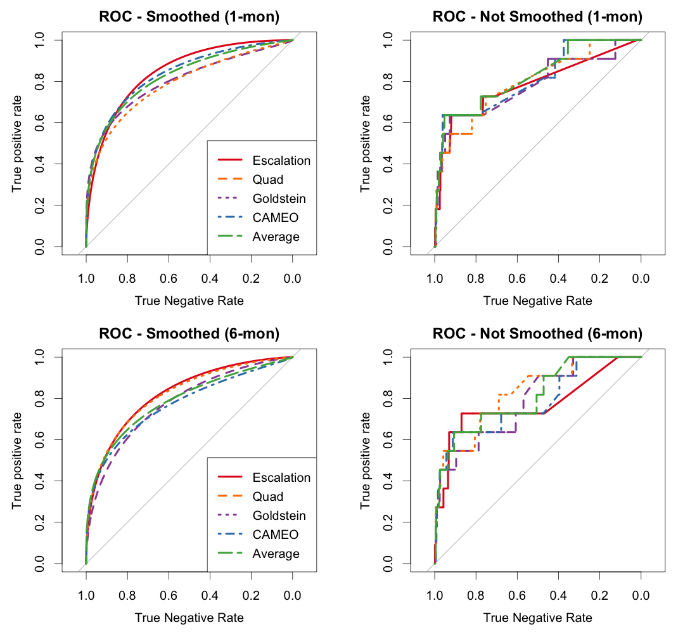

```{r setup, include=FALSE}
knitr::opts_chunk$set(echo = FALSE, message=FALSE)

library(readr)
library(dplyr)
library(tidyr)
library(tidyverse)
library(kableExtra)
library(stringr)
```
# Introduction

Blair and Sambanis (2020; hereafter B&S) argue that theory is important for creating models that have high accuracy in forecasting civil war onset.  Indeed they argue that with such theory, forecasting is more accurate than has previously been possible.  Setting aside the validity of this argument, we re-examine the empirical basis for the claims made in their article.  We find that these claims are false.  Their theory-based escalation model does not do better than the alternatives that they examine, indeed it does worse.  The reason for this reversal of their conclusion is that they have made several mistakes in their research procedure: 1) they use smoothed performance curves instead of the unsmoothed curves, 2) they mistakenly encode the dependent variable to be incidents of civil war, rather than as they claim the onset of a civil war, 3) they mistakenly calculate the predicted values for the alternative "non-theoretical" models that they compare to.  In what follows we show the impact of these mistakes on the conclusions, we examine their understanding of prediction itself, and we explore the logic of their assertion about theory as well. 

B&S claim (page 3) to show that a model informed by procedural theories of escalation and de-escalation can predict the onset of civil wars "remarkable accurately." Indeed they argue that this so-called theoretical model outperforms four other "more mechanical" alternatives. Second, they clam that the integration of structure with process are better over short forecasting windows. Third they preregisted the list of thirty countries which have the highest risk of civil war onset. They claim that such prospective predictions are rare in the literature when in fact they have been routine for many years with several prominent projects. B&S claim to be unique in assessing these forecasts. A qualitative analysis of their predictions allows them to conclude that their model is strong and a more precise test is undertaken. We will return to their analysis later, after correcting the procedural mistakes we found in their research process.

Before proceeding, we quote B&S (page 24):
\begin{quote}
Our theoretically driven model generates accurate forecasts, with base specification
AUCs of 0.82 and 0.85 over one- and six-month windows, respectively, and AUCs
as high as 0.92 in other specifications. Our model also consistently and sometimes
dramatically outperforms the alternatives we test... Cederman and Weidmann (2017, 476) argue that "the hope that
big data will somehow yield valid forecasts through theory-free 'brute force' is
misplaced in the area of political violence." Our results lend some credence to this
claim.
\end{quote}


# Review of Blair and Sambanis 2020

@blair2020forecasting (B&S hereafter) aim to examine whether theory adds more value to a forecasting model when compared to non-parametric machine learning models, and specifically random forests, whose specifications are not theory-informed. For the moment we set aside a) the logic of this hypothesis and b) whether their model has more theory than is typically found in empirical conflict models.  In short, they uphold their hypothesis that theory guided empirical research produces better conflict predictions than machine learning inspired efforts that are essentially ad hoc combinations of available variables. They arrive at this conclusion by examining the problem of predicting civil war onset. They report that a parsimonious model using a small number of covariates derived from escalation theories of conflict can forecast civil war onset better than alternative specifications based on generic covariates not specifically informed by theory including a \textit{kitchen sink} model with more than 1,000 covariates. 

B&S specifically examine three questions: 

1. How does the theoretically-driven escalation model compare in forecast performance to alternative models not informed specifically by civil war onset theories?
2. Does annual, structural information from the PITF instability forecasting model add to the escalation model's monthly and 6-month predictions?
3. How accurate were predictions using the escalation model for the first half of 2016?

To assess the first two questions, B&S use ICEWS data covering all major countries from 2001 to 2015. Two versions of the dataset are used, one at the country-month level, the other aggregated to 6-month half-years. The main outcome variable is civil war onset, measured using Sambanis' civil war dataset. 

Both the first and second questions above rely on comparing their escalation model to various alternative models. The same procedure is used in both cases:

1. Split the training data into training (2001 - 2007) and test (2008 - 2015) sets.
2. Estimate the escalation and other competing models. 
3. Create out-of-sample (OOS) predictions from each model using the test set. 
4. Calculate AUC-ROC measures for each set of OOS predictions.

To examine the first question, B&S compare the test set of the escalation model to four alternative models. The independent variables for the first set of analysis reported in Table 1 in the paper are all derived from the ICEWS event data, using domestic events between actors within a country. The models are:
- Escalation: a set of ten indicators, putatively drawn from a theoretical escalation model.
- Quad: ICEWS quad counts, i.e. material conflict, material cooperation, verbal conflict, verbal cooperation.
- Goldstein: -10 (conflictual) to 10 (cooperative) scores derived from the ICEWS data for interactions between the government one one side and opposition or rebel actors on the other. These are directed, thus making for four total covariates.
- CAMEO: counts for all CAMEO event codes totalling $1,159$ covariates, which are mostly zero for any country in any month. 
- Average: unweighted average of the predictions from the four models briefly described above.


The corresponding results for each question are shown in B&S Tables 1 and 2, which we will examine further below. We accurately replicate their Tables 1 and 2, with very tiny differences. 
The results in Table 1, aside from the core base specification results, include eight additional robustness tests for both the 1-month and 6-month versions. These robustness checks vary either (1) random forecast hyperparameter values, or (2) the year used to split the train/test data, or (3) alternative codings of the civil war onset dependent variable. 

The second question, whether structural variables add to the escalation model, is assessed by comparing the original escalation model to four alternatives that incorporate annual, structural variables that are used in the PITF instability forecasting model:

- Escalation Only: the original basic escalation model with only ICEWS predictors
- With PITF Predictors: a random forest that as predictors has the escalation model indicators but also the PITF annual, structural variables
- Weighted by PITF: escalation model predictions weighted using the PITF instability model predictions
- PITF Split Population: the training data are split into high and low risk portions based on the PITF instability model predictions, two separate escalation random forests are trained on the splits, then re-combined into a single random forest that is used to create the test set predictions
- PITF Only: a random forest model based only on the annual, structural PITF model predictors

The corresponding results are shown in B&S Table 2. 

Finally, B&S used their escalation model to create forecasts for the first half of 2016, and in their third and final analysis, they score the forecasts accuracy using civil war onset data later observed. This is summarized in B&S Table 3. 

# Replication problems

While replicating and analyzing B&S's results, we found several issues worthy of further discussion and investigation.
These are a) the use of smoothed ROC curves to draw conclusions about which model is best, b) an incorrect implementation of the weighted by ICEWS data model, c)  an inconsistent test set $ for the models examined, d) incorrect scoring of the 2016 forecasts, e) an inappropriate use of random forrest implementation, with very unusual hyperparameters.  Our belief is that these research decisions lead B&S to draw conclusion that are incorrect. The escalation model is not the best and it actually performs worse that the atheoretical, garbage can model with over $1000$ variables.  We turn to discussing these five issues below.

## Smoothed ROC curves

The most consequential issue that we found is that all AUC-ROC values reported in B&S Tables 1 and 2 are calculated using smoothed ROC curves, not the original, actual ROC curves. A reference to smoothing is made in a single sentence in the paper (p. 12):

> Figure 1 displays the corresponding ROC curves, smoothed for ease of interpretation.

This implies that the ROC curves were only smoothed in the references Figure 1, but actually all AUC-ROC calculations throughout the replication code use an option to smooth the ROC curves prior to AUC calculation. 
The reason to use a smoothed curve is that you have a continuous dependent variable (not the case here) which can produce any value of the dependent variable.  Wherein there is a discrete number of actual outcomes there is no justification for using smoothed ROC plots, nor for caculating statistics based on them.  Moreover, it is easy to compute the nonsmoothed ROC curve, and associated statistics, so computational ease does not justify this choice.

Figure 1 shows our replication of both the smoothed ROC curves B&S report, and the actual ROC curves on the right. 



ROC curves typically appear step-like in response to the distribution of positive and negative cases in the data. In this case, there are also groups of cases with identical predicted probabilities, which accounts for the unusual diagonal lines as seen in the panels on the right. In any case, with a sparse outcome like civil war onsets, the true positive rate on the *y*-axis only changes when the prediction for a observed positive case is reached. For these ROC curves, and for that matter in the basic train/test split used for 12 of the 18 rows/models in B&S Table 1, there are only 11 civil war onset cases in the test set. Thus, the ROC curves here are very step-like, with only 12 (11 positive cases plus 1 for TPR = 0) distinct *y* coordinates.  Notice also that the smoothing averages the left most almost straight line with the right most almost straight line in a monotonic way. This ignores the fact that the actual ROC 

Table \ref{tab:table1-smooth} is our replication of B&S Table 1 with smoothed AUC-ROC. The results differ slightly from the original B&S Table 1, typically by no more than 0.01, due to the non-deterministic nature of the RF models. It is the case that B&S set the RNG seed in their replication code, which should theoretically allow exact reproduction, but (1) there was a change in more recent versions of R that affected the RNG seeding process, and (2) we refactored the replication script to allow one to run the models in parallel. In any case, the interpretation of results should not be sensitive to random variation, i.e. it should not depend on using a specific RNG seed. On the basis of these results, B&S conclude that the escalation model is generally superior to the alternatives, and we can replicate that interpretation when using smoothed ROC curves. 

```{r table1-smooth}
table1_smooth <- read_csv("data/table1-smooth.csv")

table1_smooth %>%
  select(-horizon) %>%
  knitr::kable(
    digits = 2, booktabs = TRUE, 
    caption = "Replication of B\\&S Table 1 with smoothed ROC curves; test set AUC-ROC for various models",
    label = "table1-smooth") %>% 
  pack_rows(index = c("One-month forecasts" = 9, "Six-month forecasts" = 9))
```

Table \ref{tab:table1-nosmooth} shows a version of B&S Table 1 with the conventional non-smoothed ROC curves. The Average model outperforms the escalation model in 17 out of 18 cases, and the CAMEO model outperforms in 16 of 18 cases, with one tie. The Goldstein model generally outperforms the Escalation model in the 6-month version. The Quad model appears to be roughly on par with the Escalation model. Thus, the original B&S conclusion that the escalation model is superior to the alternative models is completely conditional on the non-standard use of smoothed ROC curves, and overturns when using traditional AUC-ROC calculations. 

```{r table1-nosmooth}
table1_nosmooth <- read_csv("data/table1-nosmooth.csv")

table1_nosmooth %>%
  select(-horizon) %>%
  knitr::kable(
    digits = 2, booktabs = TRUE, 
    caption = "Replication of B\\&S Table 1 \\textit{without} smoothed ROC curves; test set AUC-ROC for various models",
    label = "table1-nosmooth") %>% 
  pack_rows(index = c("One-month forecasts" = 9, "Six-month forecasts" = 9))
```

As it turns out, this decision has a dramatic impact on the AUC-ROC calculations B&S use to support their empirical claims. As we show below, the difference between the smoothed and original ROC AUC values is up to 0.12--a huge difference given that row-wise, the models being compared typically differ by only 0.05 or less--and this differentially impacts the models that are being compared. In fact, B&S's original results and interpretation are entirely conditional on the use of smoothed AUC-ROC. These results are shown in Tables 1 and 2.  The Goldstein, CAMEO, and Average model are everywhere superior to the theoretically informed escalation model.  Even the Quad model is generally as good as the escalation model in all implementations, and is frequently quite a bit better.

To our knowledge, the norm is to calculate AUC-ROC values using original, not smoothed ROC curves. We are in fact not aware of other work that uses smoothed ROC curves for AUC calculations. It might be that there are theoretical reasons justifying the use of smoothed ROC curves over the original ROC curves; but given that this decision dramatically impacts the interpretation of the B&S results, it minimally would have warranted an explicit discussion in the paper. This is not the case, and it is only mentioned in the sentence we quote above. 

The next three issues we encountered all concern information in B&S Table 2. 

## Incorrect "Weighted by PITF" implementation

The "Weighted by PITF" model is described as follows in B&S, page 19:

> The [Weighted by PITF model] uses PITF predicted probabilities to weight the results of the escalation model, ensuring that high-risk and low-risk countries that happen to take similar values on ICEWS-based predictors are nonetheless assigned different predicted probabilities in most months.

We infer that the intent is that the escalation model's predictions for the test set are weighted by the PITF model predictions for the test set. B&S, however, actually weights the \textbf{test} set predictions using the PITF model predictions for the \textbf{training} set.^[See `1mo_run_escalation_weighted_PITF.R` line 4, where the PITF predictions are taken from the training data set (`train$pred_prob_plus1`). The next line is a hack extending the shorter `weight` vector with missing values to avoid a R warning when it is multiplied with the longer vector of escalation model test set predictions. Similarly in the 6-month version of this file.] This appears to be a coding error.


NOW SHOW HOW THIS MATTERS?

## Incorrect "PITF Split Population" implementation

Similarly, the "PITF Split Population" model appears to be incorrectly implemented. B&S describe it on page 20:

> The final approach is a random forest analog to split-population modeling.
first compute the average PITF predicted probability for each country across all years in our training set. We define those that fall in the bottom quartile as "low risk" and the rest as "high risk." We then run our escalation model on the high-risk and low-risk subsets separately, combining the results into a single random forest (column 4).

The intention clearly was to run two separate random forest models, one each on the low- and high-risk training data splits. The replication code does indeed run two separate random forecasts, but they are both run on the *exact same training data*, which consists of the full training data all other models are run on. The models are also identical otherwise, i.e. they use the same *x* variables and the same random forest hyper-parameter settings. The *only* difference in the models as they are implemented in the B&S replication code is due to the non-deterministic nature of the random forest model itself. If we ran both with the same random seed, they would be identical in every respect, producing identical predictions.^[Disentangling this coding error is not straightforward as it occurs over several R scripts and requires (or at least is easier to verify by) running partway through the actual replication until the objects holding the training data for the models are instantiated and can be examined. We have documented details at https://github.com/rickmorgan2/Blair-Sambanis-replication/issues/5.] 

The implementation error aside, this split-population analog model is actually quite odd and does not actually replicate an analogue of the idea behind split-population modeling. Although the two RFs are trained on separate data (in our updated, fixed replication), the process of combining them actually just creates a new, larger RF using both component model's underlying decision (regression^[See further below. Although the RF models are used for a binary decision problem, the actual implementation uses regression RFs for continuous outcomes.]) trees. Thus, while all RF models throughout (except for one of the robustness checks) are trained with 100,000 decision trees (`ntree`), the new RF model after combination does indeed have 200,000 decision trees. Furthermore, the PITF model predictions do not impact the way the combined RF model predicts at all, not even through a binary low-/high-risk split. The split-population PITF RF model is practically speaking just another escalation model trained with N=200,000 instead of N=100,000 trees and an extra odd randomization step added to the already existing RF randomization facilities (row and column sampling for each decision tree). This does not adequately implement their research strategy.

GIVE EXAMPLE OF IMPACT HERE?

## Inconsistent test set N for the models in Table 2

Further, the AUC-ROC values reported in the original B&S Table 2 are calculated on the basis of slightly different numbers of underlying test set cases (see Table \ref{tab:table2-N}). ROC calculations for a set of predictions can only be done on the set of cases for which both non-missing predictions and non-missing outcomes are available. Those sets differ across models (columns) for each row in Table 2. Thus a difference in AUC-ROC values for two models could be due to the fact that they were calculated on different sets of underlying cases, not because the models are systemically performing at a different level. In other words, the results for different models in B&S Table 2 are actually not comparable toone another, and any conclusions drawn from such comparison are potentially incorrect. 

We fix this issue by only using predictions for common joint subset of cases that all models have non-missing predictions for. The original B&S Table 2 1-month have *N*=11,806--12,495 versus a common joint subset of 9,811, and for the 6-month row *N*=2,070--2,233 versus *N*=1,915 for the common joint subset. 


Give EXAMPLE OF IMPACT HERE?

## Incorrect scoring of the 2016 forecasts

B&S show a confusion matrix to score their 2016-H1 forecasts in Table 4. Although the forecasts are for the probability of civil war onset, in the replication code they are actually scored using the much more common incidence of civil war, i.e. including ongoing civil wars as "1"'s. 

The relevant variables in the data are "incidence_civil_ns" and "incidence_civil_ns_plus1", which appears to be a 1-period lead version of the DV that is used in the actual prediction models. The incidence DV contains both 0/1 and missing values. By examining the pattern of missing values, it seems clear that this was originally an incidence variable indicating whether a country was at civil war in a given year or not, and which was converted to an onset version so that onsets retain the value of 1 but continuing civil war years are coded as missing. This reflects common practice in how these are coded. 

By examining the code used to generated Table 4, we were able to confirm that the onset forecasts are assessed using incidence, not onset. In the file `6mo_make_confusion_matrix.do` on line 52, missing values in "incidence_civil_ns" are recoded to 1, thus reverting the onset coding of this variable back to incidence. 

# Results of the updated replication


## Do structural variables add to the Escalation model?

Table \ref{tab:table2-fixed} shows our replication of B&S Table 2 with (1) regular, not smoothed, AUC-ROC, (2) fixed "Weighted by PITF" and "PITF Split-Population" models, and (3) AUC-ROC values computed on the common joint subset of tests cases that all models have non-missing predictions for. Table \ref{tab:table2-full} further below shows AUC-ROC values for both smoothed and non-smoothed versions, and both the original, model-varying test cases sets and our common joint subset. 

```{r table2-nosmooth}
table2_nosmooth <- read_csv("data/table2-nosmooth.csv")

table2_nosmooth %>%
  dplyr::select(-Model, -horizon) %>%
  knitr::kable(
    digits = 2, booktabs = TRUE, 
    caption = "Replication of B\\&S Table 2: Test set AUC-ROC for escalation model with and without structural PITF contribution",
    label = "table2-fixed") %>%
  column_spec(2:6, width = "2cm") %>%
  pack_rows(index = c("One-month forecasts" = 1, "Six-month forecasts" = 1)) %>%
  footnote("Differences from the original B\\&S Table 2: (1) AUC-ROC values are computed on the common subset of cases, meaning that N is equal in each row; (2) AUC-ROC values are computed using original, non-smoothed ROC curves.", footnote_as_chunk = TRUE, threeparttable = TRUE)
```

B&S interpret the results as follows, on page 20:^[We list the "Overall, ..." interpretation out of order, last, for clarity.]

> Of the approaches we test, the split-population analog is most promising

This is not the case anymore. It outperforms in the 1-month version and under-performs the escalation model in the 6-month version. 

> Adding PITF predictors improves the performance of the escalation model over six-month windows but diminishes it over one-month windows. 

Adding PITF predictors actually improves performance in both cases; the "With PITF Predictions" model strictly dominates the "Escalation Only" model. 

> The weighted model performs very poorly regardless. 

It performs roughly on par with the Escalation Only model. 

One finding that remains is that the "PITF Only" model is outperformed by the "Escalation Only" model. As the former only uses annual inputs, but the data at hand are the 1-month or 6-months level, this is not surprising. 

> Overall, our results suggest that while measures of structural risk may improve predictive performance, the value they add is marginal and inconsistent. [...] Incorporating PITF thus significantly reduces or only slightly improves the performance of the escalation model, regardless of the approach we take. 

The most straightforward method of incorporating the annual, structural PITF variables--adding them to the predictors of the Escalation RF model--strictly outperforms the Escalation Only model. Note that the two other combination models considered are both non-standard, and that the "PITF Split Population" model does not in fact actually incorporate structural information at all. We thus conclude that adding structural variables actually clearly improves predictive performance.

## The effect of using smoothed ROC curves

```{r}
table1_benefit <- read_csv("data/table1-smooth-benefit.csv") 
table1_benefit %>%
  select(-horizon) %>%
  knitr::kable(
    digits = 2, booktabs = TRUE, 
    caption = "Smoothing advantage for B\\&S Table 1: the gain in AUC-ROC when calculated using smoothed ROC curves",
    label = "table1-benefit") %>% 
  pack_rows(index = c("One-month forecasts" = 9, "Six-month forecasts" = 9))

table2_benefit <- read_csv("data/table2-smooth-benefit.csv") 
table2_benefit %>%
  select(-horizon) %>%
  knitr::kable(
    digits = 2, booktabs = TRUE, 
    caption = "Smoothing advantage for B\\&S Table 2: the gain in AUC-ROC when calculated using smoothed ROC curves",
    label = "table2-benefit") %>% 
  column_spec(2:6, width = "2cm") %>%
  pack_rows(index = c("One-month forecasts" = 1, "Six-month forecasts" = 1))
```

What impact did the ROC smoothing have overall on the results reported in B&S Tables 1 and 2? Tables \ref{tab:table1-benefit} and \ref{tab:table2-benefit} show the increase in AUC-ROC when using smoothed ROC curves, compared to the standard non-smoothed AUC-ROC. Positive values indicate that smoothing increased a model's apparent performance. The escalation model is the only model that consistently had a benefit from smoothing. For all eight other models, smoothing sometimes gave a benefit, sometimes not. 

A more dramatic difference stands out when we consider the overall average impact of smoothing across all flavors of a model reported in the columns of the tables. The Average, Goldstein, Quad, PITF Split Population, and Weighted by PITF models are slightly hurt by smoothing, but on the order of less than 0.01 in absolute magnitude. The "With PITF Predictors" model is hurt on the order of 0.02, i.e. it appears substantially worse with smoothing. The CAMEO and PITF Only models benefit slightly, on the order of 0.01 or less. The escalation only model on the other hand has an average boost of 0.058 to its AUC-ROC from smoothing. Considering the spread of AUC-ROC values if we compare across rows in B&S Tables 1 and 2, that boost is substantial.

The use of smoothed ROC curves to calculate AUC-ROC values only clearly benefits the escalation model, it does so consistently, and by a considerable margin. All eight alternative models reported in Tables 1 and 2 do not on average gain when using smoothed ROC curves to calculate AUC. 

## How accurate were the 2016 forecasts?

# Additional concerns

## Random forest hyperparameters

What initially sparked our interest in the paper was the unusual choice of hyperparameter settings for the random forest models estimated. Table \ref{tab:hp} shows the default values used by the implementation of random forest that B&S use (from the **randomForest** R package), in contrast to the basic settings used by B&S for most the models reported in the paper. 

As the outcome is a binary indicator of civil war onset, one would typically use a classification random forest that predicts 0 or 1 labels directly. The implementation of random forests that B&S use ([@liaw:wiener:2002]) is based on the original @breiman:2001 implementation and calculates predictive probabilities by averaging over the "0" or "1" votes from all constituent decision trees. The conventional wisdom regarding the number of trees in a random forest is that it needs to be large enough to stabilize performance, but without any additional gain or harm in accuracy beyond a certain number. From the other default settings, which are generally not uninformed choices, one can see that the basic logic is to grow a forest with a relatively small number of trees, but where each tree is fairly extensive, and operates on a large bootstrapped sample of the original training data. These are of course only heuristics and it is usual to attempt to find better hyper-parameter methods through some form of tuning. 

\begin{table}
\caption{\label{tab:hp} Random forest (\texttt{randomForest()}) default versus B\&S hyperparameters}
\begin{tabular}{l>{\raggedright\arraybackslash}p{2in}ll}
\toprule
Hyperparameter & Default heuristic & Default values (Escalation) & B\&S value \\
\midrule
type & & classification & regression \\
ntree & & 500 & 100,000 or 1e6 \\
mtry & \texttt{floor(sqrt(ncol(x)))} & 3 & 3 \\
replace & & true & false \\
sampsize & \texttt{nrow(x)} if replace, else \texttt{ceiling(.632*nrow(x))} & 11,869 & 100 or
500 \\
nodesize & 1 for classification & 1 & 1 \\
maxnodes & & null & 5 or 10 \\
\bottomrule
\end{tabular}
\end{table}

B&S in contrast fit very large forests with 100,000 trees in the basic model form, but where each tree only operates on a very small sub-sample (N=100 or 500), drawn without replacement, of the available training data. This approach only works due to the choice to use regression, not classification, trees. Trying to use classification trees with the other parameter settings not work at all because it is almost guaranteed that a sample of 100 from the ~11,000 training data rows with 9 positive cases will only include 0 (negative) outcomes in the sample. As it is, using regression with a 0 or 1 outcome produces warnings when estimating the models: 

```
Warning message:
In randomForest.default(y = as.integer(train_df$incidence_civil_ns_plus1 ==  :
  The response has five or fewer unique values.  Are you sure you want to do regression?
```

As it turns out, using regression random forests for this kind of binary classification problem in order to obtain probability estimates matches the probability random forest approach suggested and positively evaluated in @malley:etal:2012, and which is used in another prominent R implementation of random forests.^[The **ranger** package.] It is not clear whether this is intentional, as the Malley paper is not cited in B&S. 

In any case, B&S's random forest approach appears to work really well. We tried to construct classification random forests tuned via cross-validation on the training data set partition, i.e. without touching the test data, but were unable to develop models that consistently match the B&S random forest method in both cross-validated out-of-sample training predictions and test set predictions. 

Given that they are relatively unorthodox, yet appear to work very well, we wonder how the hyper-parameter values were determined. Two specific concerns are that this was not done with an eye towards test set accuracy, which would invalidate the independence of the out-of-sample test set, and whether the specific hyper-parameter values are optimized for only one model, or were optimized and found to work well for all models. There is no discussion of the random forest tuning strategy or how the specific hyper-parameter methods were determined in the paper. 

## AUC-ROC sensitivity

RNG and variation

## Pre-registration 

- The escalation model specification, prior to looking at data!
- The hyper-parameter tuning strategy. 


# Conclusion

B&S have a clear misunderstanding of the role that out-of-sample prediction can plan in analysis.  On the one hand it can be used for simple forecasting while on the other it can be used to evaluate the performance of models, specifically to overfitting and bias.  They further misrepresent cross-validation which is not about fishing for results, as claimed by B&S.  The current state-of-the-art uses prediction and cross-validation most frequently to provide supportive evidence that is independent of the estimation procedure and the in-sample data. It is incorrect to paint this procedure as atheoretical since many studies will have some explanation for how the model was constructed. These procedures may simply be used to provide evidence for a theoretical argument.  Though that argument may be unconvincing and/or atheoretical.

The B&S approach that is advocated is to use theory to guide prediction. But theory is a quite ambiguous and undefined concept.  It is not a procedure.  What they actually do is to create a model with four right hand side variables that is supposed to capture a complicated repression-dissent dynamic.  The dynamic is probably not linear, but their model is. There is a wide-ranging literature on this dynamic that they do not rely on to construct their model.  As such their baseline comparison is hardly a standard bearer for strong theory.

Further, they completely misunderstand the use of ICEWS event data in current research. They claim that most uses to date have focused on the quad categories, but this ignores a wide swath of literature (Steinert-Threlkeld APSR 2017) and Metternich et al (AJPS 2013) that uses a specific action---such as protest---defined in the CAMEO ontology. In the AJPS article we hand coded, for example, every actor in Thailand and focused on an analysis of how those have been interacting.


We encountered several issues in the code underlying the B&S analysis. 

The issues we encountered are not subjective modeling choices. 

When we fix these issue and perform an updated analysis, the conclusions B&S draw all essentially overturn. In other words, B&S findings are based on a faulty analysis, and invalid. 

Using the same analysis B&S intend to use, we in fact find that:

- the theory-driven escalation model is outperformed both by the low-effort 1,160 predictor all CAMEO model and the Average ensemble model
- structural variables substantially improve the escalation model's performance when added to the pool of predictors on which the underlying random forest model is based.


@bdm:2011 , @ward:2016 , @montgomery:etal:PS:2012, @chiba:etal:2015, @brandt:2015  @mhw:2012,@ward:etal:2013,@chadefaux:2015,@weidmann:ward:2010,@pilster:bohmelt:2014,@Brandt_etal_2011,@gleditsch:2015,@bennett:stam:2009,@shellman:etal:2013,@hegre:etal:2011,@ward:etal:2010,@freeman:job:1979,@gneiting:raftery:2005
@choucri:1974,@choucri:robinson:1979,@goldstone:etal:2010,tetlock:etal:2017,
@rost:etal:2009,  
@hopple:andriole:1984,
@andriole:young:1977,
@brandt:etal:2011,
@brandt:etal:2014,
@mellers:etal:2015,
@tetlock:gardner:2015,
@hegre:etal:2019,
@weidmann:ward:2010, 
@beger:ward:2017,
@schrodt:1991,
@obrien:2010,
@obrien:2002,
@hegre:etal:2019,
@hegre:etal:2017,
@hegre:etal:2016,
@chiba:gleditsch:2017,
@buhaug:etal:2014,
@colaresi:mahmood:2017,
@ramakrishnan:etal:2014,
@schleussner:etal2016,
@kupilik:witmer:2018,
@witmer:etal:2017
@oloughlin:etal:2012
@hegre:etal:2013 
@buhaug:gleditsch:2008

**AB: add a table comparing B&S original claims and updated results.**


```{r, message=FALSE}
tab4o <- read_csv("data/table4-original.csv")
tab4f <- read_csv("data/table4-fixed.csv")

tab4o <- tab4o %>%
  rename(header = type) %>%
  mutate(source = "Original, scored with civil war incidence")
tab4f <- tab4f %>%
  rename(Predicted0 = `0`, Predicted1 = `1`) %>%
  mutate(source = "Fixed, scored with civil war onset")

tab4 <- bind_rows(tab4o, tab4f) %>%
  select(source, header, everything())

tab4 %>%
  knitr::kable(
    caption = "Replication of B\\&S Table 4: 2016 Confusion Matrices for Six-month Escalation Model.",
    booktabs = TRUE
  ) %>%
  kableExtra::collapse_rows(1:2, row_group_label_position = "stack")
```


```{r}
table2_full <- read_csv("data/table2-for-appendix.csv")

table2_full %>%
  select(horizon, column, N_test, cases) %>%
  pivot_wider(names_from = column, values_from = N_test) %>%
  arrange(horizon, desc(cases)) %>%
  rename(Cases = cases, Horizon = horizon) %>%
  select(Cases, Horizon, everything()) %>%
  arrange(desc(Cases), Horizon) %>%
  knitr::kable(
    "latex", booktabs = TRUE, digits = 0,
    caption = "Number of valid test predictions for each cell in B\\&S Table 2",
    label = "table2-N") %>%
  column_spec(3:7, width = "2cm") %>%
  collapse_rows(1:2, row_group_label_position = "stack") 
  
table2_full %>%
  pivot_longer(auc_roc:auc_roc_smoothed, names_to = "Smoothed ROC",
               values_to = "auc_roc") %>%
  mutate(`Smoothed ROC` = case_when(
    `Smoothed ROC`=="auc_roc" ~ "No",
    TRUE ~ "Yes")
  ) %>%
  select(horizon, column, cases, `Smoothed ROC`, auc_roc) %>%
  pivot_wider(names_from = column, values_from = auc_roc) %>%
  rename(Cases = cases, Horizon = horizon) %>%
  select(Cases, Horizon, `Smoothed ROC`, everything()) %>%
  arrange(desc(Cases), Horizon, desc(`Smoothed ROC`)) %>%
  knitr::kable(
    "latex", booktabs = TRUE, digits = 2,
               caption = "Replication of B\\&S Table 2 with smoothed/original ROC and with original varying N cases or adjusting for common case set with constant N",
    label = "table2-full") %>%
  column_spec(3, width = "1.5cm") %>%
  column_spec(4:8, width = "2cm") %>%
  collapse_rows(1:3, row_group_label_position = "stack")

```
\newpage

# References
