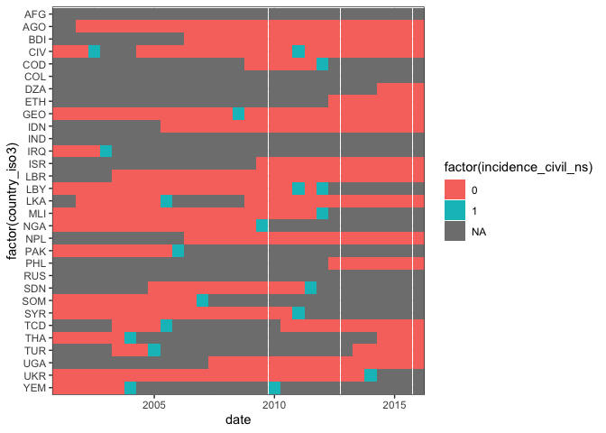

Table 4 investigation
================

Is B\&S Table 4 genered by scoring the civil war onset forecasts using
civil war incidence?

The data used to train the forecasting models is `6mo_data_OOS.dta`.
This just appears to be an extension of the regular 6 month training
data that includes and additional

``` r
data_6month_oos <- read.dta13("data/6mo_data_OOS.dta")

data_6month_oos %>% filter(year > 2013) %>% count(year, period)
```

    ##   year period   n
    ## 1 2014     27 164
    ## 2 2014     28 164
    ## 3 2015     29 164
    ## 4 2015     30 164
    ## 5 2016     31 164

The number of positive events–civil war onsets–matches what’s in the
training data, namely 20 onsets. There are no onsets recorded for 2016.

``` r
data_6month_oos %>% count(incidence_civil_ns_plus1)
```

    ##   incidence_civil_ns_plus1    n
    ## 1                        0 4581
    ## 2                        1   20
    ## 3                       NA  483

``` r
data_6month_oos %>% count(incidence_civil_ns ) 
```

    ##   incidence_civil_ns    n
    ## 1                  0 4562
    ## 2                  1   20
    ## 3                 NA  502

``` r
data_6month_oos %>% filter(year==2016) %>% count(incidence_civil_ns)
```

    ##   incidence_civil_ns   n
    ## 1                  0 149
    ## 2                 NA  15

The predictions seem to come from `6mo_predictions_escalation_OOS.dta`.

``` r
preds <- read.dta13("data/6mo_predictions_escalation_OOS.dta") %>%
  as_tibble() %>%
  # for some reason the data vectors as character, not numeric. 
  mutate(across(-country, as.numeric))
```

    ## Warning in fn(col, ...): NAs introduced by coercion
    
    ## Warning in fn(col, ...): NAs introduced by coercion
    
    ## Warning in fn(col, ...): NAs introduced by coercion

``` r
preds
```

    ## # A tibble: 2,788 x 6
    ##    country  year period incidence_civil_ns incidence_civil_ns_plus1 prediction
    ##    <chr>   <dbl>  <dbl>              <dbl>                    <dbl>      <dbl>
    ##  1 AFG      2008     15                 NA                       NA     0.0691
    ##  2 AFG      2008     16                 NA                       NA     0.0684
    ##  3 AFG      2009     17                 NA                       NA     0.0719
    ##  4 AFG      2009     18                 NA                       NA     0.0687
    ##  5 AFG      2010     19                 NA                       NA     0.0717
    ##  6 AFG      2010     20                 NA                       NA     0.0709
    ##  7 AFG      2011     21                 NA                       NA     0.0435
    ##  8 AFG      2011     22                 NA                       NA     0.0694
    ##  9 AFG      2012     23                 NA                       NA     0.0708
    ## 10 AFG      2012     24                 NA                       NA     0.0868
    ## # … with 2,778 more rows

This actually has OOS predictions from 2008 to 2016 (this also means the
latest forecasts for 2016 use stale 2007 data…):

``` r
range(preds$year)
```

    ## [1] 2008 2016

There are no onsets recorded in this either. But there are some missing
values in the non-“plus1” version of the outcome.

``` r
fcast2016 <- preds %>%
  filter(year==2016)

fcast2016 %>% count(incidence_civil_ns_plus1)
```

    ## # A tibble: 1 x 2
    ##   incidence_civil_ns_plus1     n
    ##                      <dbl> <int>
    ## 1                        0   164

``` r
fcast2016 %>% count(incidence_civil_ns )
```

    ## # A tibble: 2 x 2
    ##   incidence_civil_ns     n
    ##                <dbl> <int>
    ## 1                  0   149
    ## 2                 NA    15

``` r
fcast2016 %>%
  dplyr::filter(is.na(incidence_civil_ns)) %>%
  dplyr::select(country, year)
```

    ## # A tibble: 15 x 2
    ##    country  year
    ##    <chr>   <dbl>
    ##  1 AFG      2016
    ##  2 COD      2016
    ##  3 COL      2016
    ##  4 IND      2016
    ##  5 IRQ      2016
    ##  6 LBY      2016
    ##  7 MLI      2016
    ##  8 NGA      2016
    ##  9 PAK      2016
    ## 10 RUS      2016
    ## 11 SDN      2016
    ## 12 SOM      2016
    ## 13 SYR      2016
    ## 14 UKR      2016
    ## 15 YEM      2016

If you start out with an incidence civil war variable, like the name
here implies, and you convert it to onset, it might be that this was
done by keeping the first year as a “1” and setting the rest to missing.
Does it look like this was done here?

``` r
data_6month_oos %>%
  select(year, period, country_iso3, incidence_civil_ns, incidence_civil_ns_plus1) %>%
  group_by(country_iso3) %>%
  mutate(any_non0 = any(is.na(incidence_civil_ns)) | any(incidence_civil_ns==1)) %>%
  ungroup() %>%
  filter(any_non0==TRUE) %>%
  mutate(country_iso3 = factor(country_iso3, levels = rev(unique(country_iso3))),
         date = sprintf("%s-%02s-01", year, ifelse(period %% 2 == 1, 1, 7)),
         date = as.Date(date)) %>%
  ggplot(aes(x = date, y = factor(country_iso3), 
             fill = factor(incidence_civil_ns))) +
  geom_tile() +
  scale_x_date(expand = c(0, 0)) +
  theme_bw()
```

<!-- -->

This plot shows country-years–with countries on the *y*-axis and years
on the *x*-axis. The fill color corresponds to whether the non-lagged
outcome variable was coded as 0, 1, or missing.

It seems that all sequences of NA’s that start after 2001 are preceded
by a “1” coding. There are some isolated single half-year 1’s, and Yemen
has 2 “1”’s not separated by a non-civil war year.

Looking through the appendix:

  - Cote d’Ivoire (CIV) indeed has a single-year civil war (p. 30)
  - Libya also looks like it has a short civil war folled by longer one
    (p. 29)
  - Yemen, ok, there are two long periods of civil war separated by a
    small gap; that probably explains the onset immediately after NA
    half year (p. 28)

Ok, so this indeed seems to be onset coded from an original incidence
variable, as the name suggests anyways.

How do we get from that to B\&S Table 4?

Aha, the culprit is in `6mo_make_confusion_matrix.do`. The script loads
`predictions/6mo_predictions_escalation_OOS.dta`, drops everything prior
to 2016. Then, on lines 50-52:

``` stata
* Recode predictand
        
replace incidence_civil_ns=1 if incidence_civil_ns==.
```

So it seems that `incidence_civil_ns` went from some original incidence
version to the onset + NA for ongoing coding in the data that is used
for the R portion of the work; then prior to creating the confusion
matrices for the forecast scoring, the onset + NA for ongoing coding is
reversed, giving us back incidence coding. So indeed, the forecasts are
scored using incidence.

Here’s the alternative coding for the bottom portion, btw:

``` stata
          * Generate alternate coding of predictand
        
            gen incidence_civil_ns_alt=incidence_civil_ns
                replace incidence_civil_ns_alt=0 if country_name=="Colombia"
                replace incidence_civil_ns_alt=1 if country_name=="Turkey"
                replace incidence_civil_ns_alt=1 if country_name=="Burundi"
```

Redo a correct scoring against civil war onset.

``` r
# Hand-code the Table 3 predictions;
# The predictions don't exactly match what is in Table 3, possibly because I
# only ran the 6 month OOS portion of +master.R after setting the seed at the
# top.
pred1 <- c("Nigeria", "India", "Iraq", "Somalia", "Syria", "Pakistan",
           "Philippines", "Turkey", "Afghanistan", "Russia", "Burundi", "Egypt",
           "Yemen", "Colombia", "Mali", "China", "Indonesia", "Ukraine",
           "Sudan", "Lebanon", "Thailand", "Iran", "Myanmar", "Montenegro",
           "Bangladesh", "Niger", "El Salvador", "France", "Ghana", "Tajikistan")
codes <- countrycode::countrycode(pred1, "country.name", "iso3c")
fcast2016$label <- as.integer(fcast2016$country %in% codes)
# should be 30
sum(fcast2016$label)
```

    ## [1] 30

``` r
# What is the truth data in preds?
fcast2016 %>% count(incidence_civil_ns)
```

    ## # A tibble: 2 x 2
    ##   incidence_civil_ns     n
    ##                <dbl> <int>
    ## 1                  0   149
    ## 2                 NA    15

``` r
fcast2016 %>% count(incidence_civil_ns_plus1)
```

    ## # A tibble: 1 x 2
    ##   incidence_civil_ns_plus1     n
    ##                      <dbl> <int>
    ## 1                        0   164

``` r
# Does this match the OOS data?
data_6month_oos %>% filter(period==31) %>% count(incidence_civil_ns)
```

    ##   incidence_civil_ns   n
    ## 1                  0 149
    ## 2                 NA  15

``` r
data_6month_oos %>% filter(period==31) %>% count(incidence_civil_ns_alt1_plus1)
```

    ##   incidence_civil_ns_alt1_plus1   n
    ## 1                             0 151
    ## 2                            NA  13

``` r
tab4_top <- fcast2016 %>%
  rename(Observed = incidence_civil_ns, Predicted = label) %>%
  replace_na(list(Observed = 0L)) %>%
  mutate(Observed = factor(Observed, levels = c("0", "1")),
         Predicted = factor(Predicted, levels = c("0", "1"))) %>%
  group_by(Observed, Predicted) %>%
  dplyr::summarize(n = n()) %>%
  ungroup() %>%
  tidyr::complete(Observed, Predicted, fill = list(n = 0)) %>%
  mutate(header = "Assuming Persistence")
```

    ## `summarise()` regrouping output by 'Observed' (override with `.groups` argument)

``` r
# From 6mo_make_confusion_matrix.do, for the bottom of Table 3:
# replace incidence_civil_ns_alt=0 if country_name=="Colombia"
# replace incidence_civil_ns_alt=1 if country_name=="Turkey"
# replace incidence_civil_ns_alt=1 if country_name=="Burundi"
fcast2016 %>%
  filter(country %in% c("COL", "TUR", "BDI"))
```

    ## # A tibble: 3 x 7
    ##   country  year period incidence_civil_ns incidence_civil_ns_p… prediction label
    ##   <chr>   <dbl>  <dbl>              <dbl>                 <dbl>      <dbl> <int>
    ## 1 BDI      2016     31                  0                     0     0.0134     1
    ## 2 COL      2016     31                 NA                     0     0.0107     1
    ## 3 TUR      2016     31                  0                     0     0.0647     1

``` r
data_6month_oos %>%
  filter(country_iso3 %in% c("COL", "TUR", "BDI")) %>%
  dplyr::select(country_iso3, year, incidence_civil_ns, incidence_civil_ns_plus1)
```

    ##    country_iso3 year incidence_civil_ns incidence_civil_ns_plus1
    ## 1           BDI 2001                 NA                       NA
    ## 2           BDI 2001                 NA                       NA
    ## 3           BDI 2002                 NA                       NA
    ## 4           BDI 2002                 NA                       NA
    ## 5           BDI 2003                 NA                       NA
    ## 6           BDI 2003                 NA                       NA
    ## 7           BDI 2004                 NA                       NA
    ## 8           BDI 2004                 NA                       NA
    ## 9           BDI 2005                 NA                       NA
    ## 10          BDI 2005                 NA                       NA
    ## 11          BDI 2006                 NA                        0
    ## 12          BDI 2006                  0                        0
    ## 13          BDI 2007                  0                        0
    ## 14          BDI 2007                  0                        0
    ## 15          BDI 2008                  0                        0
    ## 16          BDI 2008                  0                        0
    ## 17          BDI 2009                  0                        0
    ## 18          BDI 2009                  0                        0
    ## 19          BDI 2010                  0                        0
    ## 20          BDI 2010                  0                        0
    ## 21          BDI 2011                  0                        0
    ## 22          BDI 2011                  0                        0
    ## 23          BDI 2012                  0                        0
    ## 24          BDI 2012                  0                        0
    ## 25          BDI 2013                  0                        0
    ## 26          BDI 2013                  0                        0
    ## 27          BDI 2014                  0                        0
    ## 28          BDI 2014                  0                        0
    ## 29          BDI 2015                  0                        0
    ## 30          BDI 2015                  0                        0
    ## 31          BDI 2016                  0                        0
    ## 32          COL 2001                 NA                       NA
    ## 33          COL 2001                 NA                       NA
    ## 34          COL 2002                 NA                       NA
    ## 35          COL 2002                 NA                       NA
    ## 36          COL 2003                 NA                       NA
    ## 37          COL 2003                 NA                       NA
    ## 38          COL 2004                 NA                       NA
    ## 39          COL 2004                 NA                       NA
    ## 40          COL 2005                 NA                       NA
    ## 41          COL 2005                 NA                       NA
    ## 42          COL 2006                 NA                       NA
    ## 43          COL 2006                 NA                       NA
    ## 44          COL 2007                 NA                       NA
    ## 45          COL 2007                 NA                       NA
    ## 46          COL 2008                 NA                       NA
    ## 47          COL 2008                 NA                       NA
    ## 48          COL 2009                 NA                       NA
    ## 49          COL 2009                 NA                       NA
    ## 50          COL 2010                 NA                       NA
    ## 51          COL 2010                 NA                       NA
    ## 52          COL 2011                 NA                       NA
    ## 53          COL 2011                 NA                       NA
    ## 54          COL 2012                 NA                       NA
    ## 55          COL 2012                 NA                       NA
    ## 56          COL 2013                 NA                       NA
    ## 57          COL 2013                 NA                       NA
    ## 58          COL 2014                 NA                       NA
    ## 59          COL 2014                 NA                       NA
    ## 60          COL 2015                 NA                       NA
    ## 61          COL 2015                 NA                       NA
    ## 62          COL 2016                 NA                        0
    ## 63          TUR 2001                 NA                       NA
    ## 64          TUR 2001                 NA                       NA
    ## 65          TUR 2002                 NA                       NA
    ## 66          TUR 2002                 NA                       NA
    ## 67          TUR 2003                 NA                        0
    ## 68          TUR 2003                  0                        0
    ## 69          TUR 2004                  0                        0
    ## 70          TUR 2004                  0                        1
    ## 71          TUR 2005                  1                       NA
    ## 72          TUR 2005                 NA                       NA
    ## 73          TUR 2006                 NA                       NA
    ## 74          TUR 2006                 NA                       NA
    ## 75          TUR 2007                 NA                       NA
    ## 76          TUR 2007                 NA                       NA
    ## 77          TUR 2008                 NA                       NA
    ## 78          TUR 2008                 NA                       NA
    ## 79          TUR 2009                 NA                       NA
    ## 80          TUR 2009                 NA                       NA
    ## 81          TUR 2010                 NA                       NA
    ## 82          TUR 2010                 NA                       NA
    ## 83          TUR 2011                 NA                       NA
    ## 84          TUR 2011                 NA                       NA
    ## 85          TUR 2012                 NA                       NA
    ## 86          TUR 2012                 NA                       NA
    ## 87          TUR 2013                 NA                        0
    ## 88          TUR 2013                  0                        0
    ## 89          TUR 2014                  0                        0
    ## 90          TUR 2014                  0                        0
    ## 91          TUR 2015                  0                        0
    ## 92          TUR 2015                  0                        0
    ## 93          TUR 2016                  0                        0

``` r
# Burundi has no ongoing conflict, so this is new onset
# Colombia has ongong conflict, so no difference
# Turkey has no ongoing conflict, so this is new onset
fcast2016_v2 <- fcast2016 %>%
  mutate(incidence_civil_ns = case_when(
    country=="TUR" ~ 1,
    country=="BDI" ~ 1,
    TRUE ~ incidence_civil_ns
  ))

tab4_bottom <- fcast2016_v2 %>%
  rename(Observed = incidence_civil_ns, Predicted = label) %>%
  replace_na(list(Observed = 0L)) %>%
  mutate(Observed = factor(Observed, levels = c("0", "1")),
         Predicted = factor(Predicted, levels = c("0", "1"))) %>%
  group_by(Observed, Predicted) %>%
  dplyr::summarize(n = n()) %>%
  ungroup() %>%
  tidyr::complete(Observed, Predicted, fill = list(n = 0)) %>%
  mutate(header = "Assuming Change")
```

    ## `summarise()` regrouping output by 'Observed' (override with `.groups` argument)

``` r
tab4 <- bind_rows(tab4_top, tab4_bottom) %>%
  dplyr::select(header, everything()) %>%
  pivot_wider(names_from = "Predicted", values_from = n)

write_csv(tab4, "output/table4-fixed.csv")

tab4
```

    ## # A tibble: 4 x 4
    ##   header               Observed   `0`   `1`
    ##   <chr>                <fct>    <dbl> <dbl>
    ## 1 Assuming Persistence 0          134    30
    ## 2 Assuming Persistence 1            0     0
    ## 3 Assuming Change      0          134    28
    ## 4 Assuming Change      1            0     2
