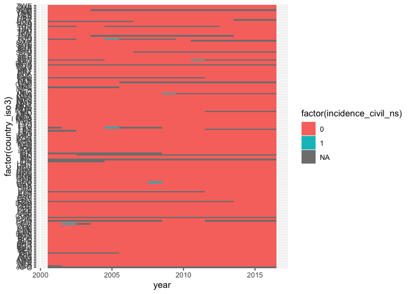
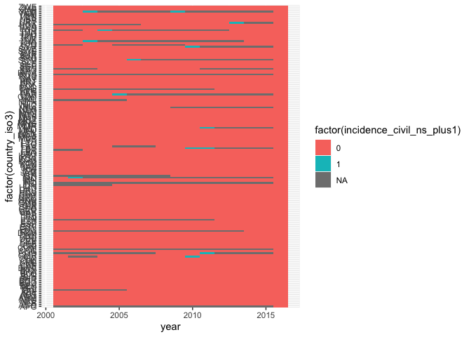
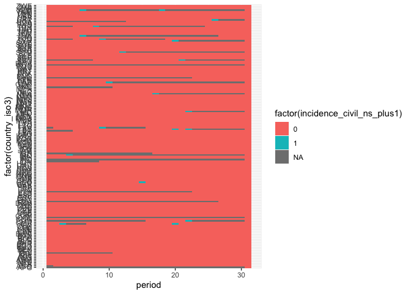

Table 4 investigation
================

``` r
data_6month_oos <- read.dta13("data/6mo_data_OOS.dta")

data_6month_oos %>% count(incidence_civil_ns_plus1)
```

    ##   incidence_civil_ns_plus1    n
    ## 1                        0 4581
    ## 2                        1   20
    ## 3                       NA  483

``` r
data_6month_oos %>% count(incidence_civil_ns )
```

    ##   incidence_civil_ns    n
    ## 1                  0 4562
    ## 2                  1   20
    ## 3                 NA  502

``` r
pred_escalation_6mo_inc_civil_ns <- read.dta13("data/6mo_predictions_escalation_OOS.dta")

# this object contains OOS forecasts from 2008 to 2016
as_tibble(pred_escalation_6mo_inc_civil_ns)
```

    ## # A tibble: 2,788 x 6
    ##    country year  period incidence_civil_ns incidence_civil_ns_p… prediction     
    ##    <chr>   <chr> <chr>  <chr>              <chr>                 <chr>          
    ##  1 AFG     2008  15     NA                 NA                    0.069138337868…
    ##  2 AFG     2008  16     NA                 NA                    0.068421271410…
    ##  3 AFG     2009  17     NA                 NA                    0.071911089794…
    ##  4 AFG     2009  18     NA                 NA                    0.068664278453…
    ##  5 AFG     2010  19     NA                 NA                    0.071694215183…
    ##  6 AFG     2010  20     NA                 NA                    0.070948765300…
    ##  7 AFG     2011  21     NA                 NA                    0.043480454996…
    ##  8 AFG     2011  22     NA                 NA                    0.069389650470…
    ##  9 AFG     2012  23     NA                 NA                    0.070806201197…
    ## 10 AFG     2012  24     NA                 NA                    0.086818325575…
    ## # … with 2,778 more rows

``` r
fcast2016 <- pred_escalation_6mo_inc_civil_ns %>%
  filter(year==2016)

fcast2016 %>% count(incidence_civil_ns_plus1)
```

    ##   incidence_civil_ns_plus1   n
    ## 1                        0 164

``` r
fcast2016 %>% count(incidence_civil_ns )
```

    ##   incidence_civil_ns   n
    ## 1                  0 149
    ## 2                 NA  15

``` r
fcast2016 %>%
  filter(is.na(incidence_civil_ns)) %>%
  dplyr::select(year, country)
```

    ## [1] year    country
    ## <0 rows> (or 0-length row.names)

``` r
# Ok, indeed it looks like "incidence_civil_ns" was originally incidence and
# then recoded to onset, with NA for continuing conflicts
data_6month_oos %>%
  ggplot(aes(x = year, y = factor(country_iso3), fill = factor(incidence_civil_ns))) +
  geom_tile()
```

<!-- -->

``` r
# How does this look in the full data?
data_6month <- read.dta13("data/6mo_data_OOS.dta")
data_6month %>%
  ggplot(aes(x = year, y = factor(country_iso3), fill = factor(incidence_civil_ns))) +
  geom_tile()
```

<!-- -->

``` r
data_6month %>%
  ggplot(aes(x = year, y = factor(country_iso3), fill = factor(incidence_civil_ns_plus1))) +
  geom_tile()
```

<!-- -->

``` r
# What's going on with the positive cases here?
dv <- data_6month %>%
  filter(incidence_civil_ns==1) %>%
  dplyr::select(country_name, country_iso3, year, period, incidence_civil_ns)
dv_plus1 <- data_6month %>%
  filter(incidence_civil_ns_plus1==1) %>%
  dplyr::select(country_name, country_iso3, year, period, incidence_civil_ns_plus1)
both_dvs <- full_join(dv_plus1, dv) %>%
  arrange(country_name, year)
```

    ## Joining, by = c("country_name", "country_iso3", "year", "period")

``` r
ggplot(data_6month, aes(x = period, y = factor(country_iso3),
                        fill = factor(incidence_civil_ns_plus1))) +
  geom_tile()
```

<!-- -->

``` r
# Predictions
preds <- read.dta13("data/6mo_predictions_escalation_OOS.dta") %>%
  as_tibble() %>%
  filter(period==max(period)) %>%
  mutate(incidence_civil_ns = as.integer(incidence_civil_ns),
         incidence_civil_ns_plus1 = as.integer(incidence_civil_ns_plus1))
```

    ## Warning in mask$eval_all_mutate(dots[[i]]): NAs introduced by coercion

``` r
# Hand-code the Table 3 predictions;
# The predictions don't exactly match what is in Table 3, possibley because I
# only ran the 6 month OOS portion of +master.R after setting the seed at the
# top.
pred1 <- c("Nigeria", "India", "Iraq", "Somalia", "Syria", "Pakistan",
           "Philippines", "Turkey", "Afghanistan", "Russia", "Burundi", "Egypt",
           "Yemen", "Colombia", "Mali", "China", "Indonesia", "Ukraine",
           "Sudan", "Lebanon", "Thailand", "Iran", "Myanmar", "Montenegro",
           "Bangladesh", "Niger", "El Salvador", "France", "Ghana", "Tajikistan")
codes <- countrycode::countrycode(pred1, "country.name", "iso3c")
preds$label <- as.integer(preds$country %in% codes)
# should be 30
sum(preds$label)
```

    ## [1] 30

``` r
# What is the truth data in preds?
preds %>% count(incidence_civil_ns)
```

    ## # A tibble: 2 x 2
    ##   incidence_civil_ns     n
    ##                <int> <int>
    ## 1                  0   149
    ## 2                 NA    15

``` r
preds %>% count(incidence_civil_ns_plus1)
```

    ## # A tibble: 1 x 2
    ##   incidence_civil_ns_plus1     n
    ##                      <int> <int>
    ## 1                        0   164

``` r
# Does this match the OOS data?
data_6month_oos %>% filter(period==31) %>% count(incidence_civil_ns)
```

    ##   incidence_civil_ns   n
    ## 1                  0 149
    ## 2                 NA  15

``` r
data_6month_oos %>% filter(period==31) %>% count(incidence_civil_ns_alt1_plus1)
```

    ##   incidence_civil_ns_alt1_plus1   n
    ## 1                             0 151
    ## 2                            NA  13

``` r
tab4_top <- preds %>%
  rename(Observed = incidence_civil_ns, Predicted = label) %>%
  replace_na(list(Observed = 0L)) %>%
  mutate(Observed = factor(Observed, levels = c("0", "1")),
         Predicted = factor(Predicted, levels = c("0", "1"))) %>%
  group_by(Observed, Predicted) %>%
  dplyr::summarize(n = n()) %>%
  ungroup() %>%
  tidyr::complete(Observed, Predicted, fill = list(n = 0)) %>%
  mutate(header = "Assuming Persistence")
```

    ## `summarise()` regrouping output by 'Observed' (override with `.groups` argument)

``` r
# From 6mo_make_confusion_matrix.do, for the bottom of Table 3:
# replace incidence_civil_ns_alt=0 if country_name=="Colombia"
# replace incidence_civil_ns_alt=1 if country_name=="Turkey"
# replace incidence_civil_ns_alt=1 if country_name=="Burundi"
preds %>%
  filter(country %in% c("COL", "TUR", "BDI"))
```

    ## # A tibble: 3 x 7
    ##   country year  period incidence_civil_… incidence_civil_ns… prediction    label
    ##   <chr>   <chr> <chr>              <int>               <int> <chr>         <int>
    ## 1 BDI     2016  31                     0                   0 0.0134470646…     1
    ## 2 COL     2016  31                    NA                   0 0.0106598520…     1
    ## 3 TUR     2016  31                     0                   0 0.0646999504…     1

``` r
data_6month_oos %>%
  filter(country_iso3 %in% c("COL", "TUR", "BDI")) %>%
  dplyr::select(country_iso3, year, incidence_civil_ns, incidence_civil_ns_plus1)
```

    ##    country_iso3 year incidence_civil_ns incidence_civil_ns_plus1
    ## 1           BDI 2001                 NA                       NA
    ## 2           BDI 2001                 NA                       NA
    ## 3           BDI 2002                 NA                       NA
    ## 4           BDI 2002                 NA                       NA
    ## 5           BDI 2003                 NA                       NA
    ## 6           BDI 2003                 NA                       NA
    ## 7           BDI 2004                 NA                       NA
    ## 8           BDI 2004                 NA                       NA
    ## 9           BDI 2005                 NA                       NA
    ## 10          BDI 2005                 NA                       NA
    ## 11          BDI 2006                 NA                        0
    ## 12          BDI 2006                  0                        0
    ## 13          BDI 2007                  0                        0
    ## 14          BDI 2007                  0                        0
    ## 15          BDI 2008                  0                        0
    ## 16          BDI 2008                  0                        0
    ## 17          BDI 2009                  0                        0
    ## 18          BDI 2009                  0                        0
    ## 19          BDI 2010                  0                        0
    ## 20          BDI 2010                  0                        0
    ## 21          BDI 2011                  0                        0
    ## 22          BDI 2011                  0                        0
    ## 23          BDI 2012                  0                        0
    ## 24          BDI 2012                  0                        0
    ## 25          BDI 2013                  0                        0
    ## 26          BDI 2013                  0                        0
    ## 27          BDI 2014                  0                        0
    ## 28          BDI 2014                  0                        0
    ## 29          BDI 2015                  0                        0
    ## 30          BDI 2015                  0                        0
    ## 31          BDI 2016                  0                        0
    ## 32          COL 2001                 NA                       NA
    ## 33          COL 2001                 NA                       NA
    ## 34          COL 2002                 NA                       NA
    ## 35          COL 2002                 NA                       NA
    ## 36          COL 2003                 NA                       NA
    ## 37          COL 2003                 NA                       NA
    ## 38          COL 2004                 NA                       NA
    ## 39          COL 2004                 NA                       NA
    ## 40          COL 2005                 NA                       NA
    ## 41          COL 2005                 NA                       NA
    ## 42          COL 2006                 NA                       NA
    ## 43          COL 2006                 NA                       NA
    ## 44          COL 2007                 NA                       NA
    ## 45          COL 2007                 NA                       NA
    ## 46          COL 2008                 NA                       NA
    ## 47          COL 2008                 NA                       NA
    ## 48          COL 2009                 NA                       NA
    ## 49          COL 2009                 NA                       NA
    ## 50          COL 2010                 NA                       NA
    ## 51          COL 2010                 NA                       NA
    ## 52          COL 2011                 NA                       NA
    ## 53          COL 2011                 NA                       NA
    ## 54          COL 2012                 NA                       NA
    ## 55          COL 2012                 NA                       NA
    ## 56          COL 2013                 NA                       NA
    ## 57          COL 2013                 NA                       NA
    ## 58          COL 2014                 NA                       NA
    ## 59          COL 2014                 NA                       NA
    ## 60          COL 2015                 NA                       NA
    ## 61          COL 2015                 NA                       NA
    ## 62          COL 2016                 NA                        0
    ## 63          TUR 2001                 NA                       NA
    ## 64          TUR 2001                 NA                       NA
    ## 65          TUR 2002                 NA                       NA
    ## 66          TUR 2002                 NA                       NA
    ## 67          TUR 2003                 NA                        0
    ## 68          TUR 2003                  0                        0
    ## 69          TUR 2004                  0                        0
    ## 70          TUR 2004                  0                        1
    ## 71          TUR 2005                  1                       NA
    ## 72          TUR 2005                 NA                       NA
    ## 73          TUR 2006                 NA                       NA
    ## 74          TUR 2006                 NA                       NA
    ## 75          TUR 2007                 NA                       NA
    ## 76          TUR 2007                 NA                       NA
    ## 77          TUR 2008                 NA                       NA
    ## 78          TUR 2008                 NA                       NA
    ## 79          TUR 2009                 NA                       NA
    ## 80          TUR 2009                 NA                       NA
    ## 81          TUR 2010                 NA                       NA
    ## 82          TUR 2010                 NA                       NA
    ## 83          TUR 2011                 NA                       NA
    ## 84          TUR 2011                 NA                       NA
    ## 85          TUR 2012                 NA                       NA
    ## 86          TUR 2012                 NA                       NA
    ## 87          TUR 2013                 NA                        0
    ## 88          TUR 2013                  0                        0
    ## 89          TUR 2014                  0                        0
    ## 90          TUR 2014                  0                        0
    ## 91          TUR 2015                  0                        0
    ## 92          TUR 2015                  0                        0
    ## 93          TUR 2016                  0                        0

``` r
# Burundi has no ongoing conflict, so this is new onset
# Colombia has ongong conflict, so no difference
# Turkey has no ongoing conflict, so this is new onset
preds_v2 <- preds %>%
  mutate(incidence_civil_ns = case_when(
    country=="TUR" ~ 1L,
    country=="BDI" ~ 1L,
    TRUE ~ incidence_civil_ns
  ))

tab4_bottom <- preds_v2 %>%
  rename(Observed = incidence_civil_ns, Predicted = label) %>%
  replace_na(list(Observed = 0L)) %>%
  mutate(Observed = factor(Observed, levels = c("0", "1")),
         Predicted = factor(Predicted, levels = c("0", "1"))) %>%
  group_by(Observed, Predicted) %>%
  dplyr::summarize(n = n()) %>%
  ungroup() %>%
  tidyr::complete(Observed, Predicted, fill = list(n = 0)) %>%
  mutate(header = "Assuming Change")
```

    ## `summarise()` regrouping output by 'Observed' (override with `.groups` argument)

``` r
tab4 <- bind_rows(tab4_top, tab4_bottom) %>%
  dplyr::select(header, everything()) %>%
  pivot_wider(names_from = "Predicted", values_from = n)

write_csv(tab4, "output/tab4-fixed.csv")

tab4
```

    ## # A tibble: 4 x 4
    ##   header               Observed   `0`   `1`
    ##   <chr>                <fct>    <dbl> <dbl>
    ## 1 Assuming Persistence 0          134    30
    ## 2 Assuming Persistence 1            0     0
    ## 3 Assuming Change      0          134    28
    ## 4 Assuming Change      1            0     2
